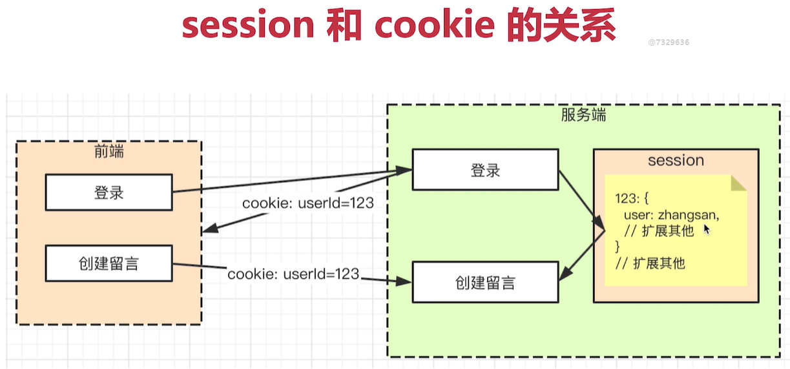
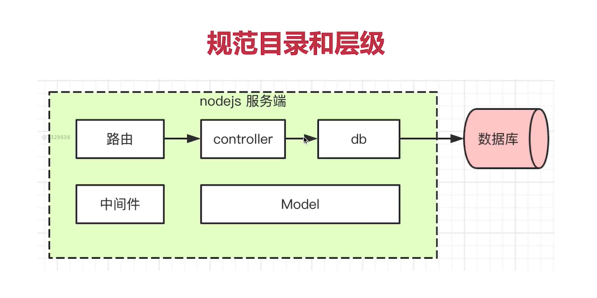

# 用vue+koa2+mongoDB实现留言板

## 如何运行起来vue + koa2 + mongoDB项目

### mongoDB数据库开启服务

安装目录bin文件下

```cmd
mongod.exe --dbpath C:\MongoDB\data\db
```

### 启动koa2服务

进入`vue`文件夹根目录`cmd`

```cmd
npm install
npm run dev
```

### 启动vue项目

进入`koa2`文件夹根目录`cmd

```cmd
npm install
npm run start
```

## 你可能会遇到一些问题

### cookie

#### cookie是什么

最大5kb, 每个域都有一个cookie，跨域不共享;格式如k1=v1;k2=v2;k3=v3;可结构化

cookie会随着http请求传递到服务端，服务端可修改后再返回给前端，默认跨域不可传递cookie

#### 服务端操作cookie

```js
res.setHeader('Set-Cookie', 'a=100')
```

**获取cookie**

```
const cookieStr =  res.headers.cookie
```

**结构化cookie**(很重要)

即把字符串变成对象  cookieStr => obj   和queryString是一样的概念

```js
const cookieObj = {}
cookieStr.split(';').forEach(cookieItemStr => {
	const arr = cookieItemStr.trim().split('=')
	const key = arr[0]
	const val = arr[1]
	cookieObj[key] = val
})
```

koa2已经把结构化给我们做好了

```js
app.use(async (ctx) => {
	// 设置cookie
	ctx.cookies.set('a', '100')
	//获取
	ctx.cookies.get('a')
})
```

#### cookie如何用于登录校验

请求登录接口，成功则设置cookie, 如user=zhangsan

前端再请求其他接口，就会带着上述的cookie

服务端判断cookie有无user=zhangsan ,即可验证

### session

#### session是什么

cookie不能暴露用户名， 比如user=zhangsan，存放这种明文信息非常危险

解决方案，cookie存放一个用户标识，如userId = 23

cookie存放用户标识，用户信息存储在session中，session即用户信息的存储，和cookie有对应关系



session和cookie的关系

session存储用户信息

### koa2

使用npm插件koa-generic-session

```js
//自动配置了cookie和session
app.user(session({
  //配置cookie
  cookie: {
    path: '/', // cookie在根目录下有效
    httpOnly: true, // cookie只允许服务端来操作
    maxAge: 24*60*60*1000 //cookie的过期时间
  }
}))
```

使用ctx.session

```js

//session常用于登录，存储用户信息（cookoe对应), 用户访问次数也是用户信息
// cookie是登陆成功后设置的，用户没有登录也是可以设置的
router.get('/sessiontest', async (ctx, next) => {
  //ctx.session
  if (ctx.session.viewcount === null) {
    ctx.session.viewcount = 0
  }
  // 用户已经访问过了
  ctx.session.viewcount++ //递增
  //返回
  ctx.body = {
    title: 'sessiontest',
    viewcount: ctx.session.viewcount
  }
})
```

#### 模拟登录

```js
//模拟登录
router.get('/login-mock', async(ctx,next) => {
  let str = ''
  const query = ctx.query //url参数，queryString
  if (query.username) {
    //模拟登录成功
    ctx.session.userInfo = {
      username: query.username
    }
    str = 'login ok'
  } else {
    str = 'login failed'
  }
  //模拟登录失败
  ctx.body = str
})

```

#### 模拟验证

```js
//模拟登录验证
router.get('/login-check-mock', async(ctx,next) => {
  
  ctx.body = ctx.session.userInfo || {}
})
```

### 完善登录功能

登录功能，对接数据库

比如对`\list`的校验

```js
// 定义路由：模拟获取留言板列表
const loginCheck = require('...')
router.get('/list', loginCheck,  async (ctx, next) => {
    const query = ctx.query // req 功能
    console.log('query', query)
    // ctx.body = 'api list' // res 功能
    //获取数据库数组
    const commentList = await Comment.find().sort({_id: -1})
    ctx.body = {
        errno: 0,
        data: commentList
    }
})
```

```js
//登录验证的中间件 在单独js文件中
async function loginCheck (ctx, next) {
    const userInfo = ctx.session.userInfo
    if (userInfo && userInfo.username) {
        //登录验证成功
        await next()
        return
    }
    //失败
    ctx.body = {
        errno: -1,
        message: '请登录'
        
    }
}
module.exports = loginCheck
```

在`/users/login`下设置了用户登录，例如`/users/login?username=xxxx&password=123`，则可以用过校验，否则会显示`{errno: -1,message: '请登录'}`

```js
router.prefix('/users')
router.get('/login', async(ctx, next) => {
  const {username, password} = ctx.query
  //const {username, password}  = ctx.request.body 这个是post请求
  const user = await User.findOne({
    username,
    password
  })

  if(user!=null) {
    //登陆成功
    ctx.session.userInfo = user
    //返回
    ctx.body = {
      errno: 0,
      data: user
    }
  } else {
    //失败
    ctx.body = {
      errno:-1,
      message: '用户名或者密码错误'
    }
  }
})
```

### 留言板项目

#### 需求分析

需求很重要

原型图

功能描述

#### 数据库设计

mongodb创建数据库和集合

- 创建数据库comment
- 创建集合comments，存储留言数据
- 创建集合users，存储用户

回顾mongoose

mogoose定义Schema和model

#### 接口（路由）设计

需要哪些接口

- 注册
- 登录
- 获取列表 
- 创建留言 
- 更新 
- 删除

哪些接口需要登录验证

- 登录注册不需要 
- 其他都需要

登录如何实现（**<u>跨域传递cookie</u>**)

#### 初始化开发环境

- 重新初始化koa2环境

```js
npm install -g koa-generator
koa2 test6 //创建test6工程目录
```

- 把目录下的public、routes、views、app.js放至自己新建的文件夹src下

规范目录和层级



- 在src下新建controller文件夹、middleware文件夹、model文件夹、db文件夹（拆分模块，职责明确，层次清晰）

- 连接数据库

  ```
  npm i mogoose --save
  ```

  创建 db/db.js

  ```js
  //连接mongoodb数据库服务
  const mongoose = require('mongoose')
  const url = 'mongodb://localhost:27017'
  const dbName = 'comments3'
  
  mongoose.set('useCreateIndex', true)
  mongoose.set('useFindAndModify', false)
  
  //开始连接
  mongoose.connect(`${url}/${dbname}`, {
      useNewUrlParser: true,
      useUnifiedTopology: true
  })
  
  //获取连接对象
  const coon = mongoose.connection
  
  coon.on('error', err=> {
      console.error('mongodb连接出错', err)
  })
  ```

  创建model/User.js和model/Comments.js

  ```js
  //User Model
  
  const mongoose  = require('../db/db')
  
  const UserSchema = mongoose.Schema({
      username: {
          type: String,
          require: true,
          unique: true
      },
      password: String,
      age: Number,
      city:String,
      gender: {
          type:Number,
          default:0 // 0保密 1男 2女
      }
  }, {
      timestamps: true // 时间戳
  })
  
  const User = mongoose.model('user', UserSchema)//第一参数对应到数据库的collection
  
  module.exports = User
  ```

  ```js
  //Comment Model
  
  const mongoose  = require('../db/db')
  
  const CommentSchema = mongoose.Schema({
      content: {
          type: String,
          required: true //必须
      },
      username: String
  }, {
      timestamps: true // 时间戳
  })
  
  const Comment = mongoose.model('comment', CommentSchema)//第一参数对应到数据库的collection
  
  module.exports = Comment
  ```

#### 项目开发

前端代码介绍

跨域&跨域传递cookie

- 前后端分离，两者不一个域，默认ajax有跨域限制

  服务端`npm koa2-cors --save`

  ```js
  // app.js
  const cors = require('koa2-cors')
  //服务端支持跨域
  app.use(cors({
    origin:'http://localhost:8080', //支持前端哪个域可以跨域 //*表示支持所有域，前提是不要求跨域带cookie
    credentials: true //允许跨域的时候带着cookie
  }))
  ```

- 另外前端跨域时也要带上cookie

  ```js
  //vue中 跨域带 cookie
  axios.defaults.withCredentials = true
  ```

**注册**

重点体会路由和controller之间的调用关系

```js
//在routes下的user.js中
//注册
const router = require('koa-router')()
const {register}  = require('../controller/user')

router.prefix('/users')
router.post('/register', async(ctx, next) =>  {
  //获取注册信息
  const userInfo = ctx.request.body
  //提交注册
  try{
    const newUser = await register(userInfo)
    //成功
    ctx.body = {
      errno: 0,
      data: newUser
    }
  } catch (ex){
    console.error('注册失败', ex)
    ctx.body ={
      errno:-1,
      message: '注册失败'
    }
  }

})
```

```js
//user Controller
const User = require('../model/User')

//注册
async function register (userInfo = {}) {
    //插入数据库
    const newUser = await User.create(userInfo)
    //返回注册的用户信息
    return newUser
}

module.exports  = {
    register
}
```

**登录**

基本和注册流程相同

但是需要用session保存用户数据`npm i koa-generic-session --save`

```js
//app.js
const session = require('koa-generic-session')

//配置session
app.keys = ['dfdfdfdf/uUsf3434.dfdf'] //自定义秘钥
app.use(session({
  cookie: {
    path: '/',
    httpOnly: true,
    maxAge: 24*60*60*1000 //一天
  }
}))
```

```js
//在routes下的user.js中
//登录
router.post('/login',async(ctx, next) =>  {
  //获取登录信息
  const { username, password} = ctx.request.body  
  //验证 登录
  const res = await login(username, password)
  if (res) {
    //登录成功
    
    //设置session
    ctx.session.userInfo ={
      username
    }
    //返回
    ctx.body= {
      errno: 0
    } 
  }else {
    ctx.body = {
      errno: -1,
      message: '登录验证失败'
    }
  }
})

```

其他模块要用到中间件验证

```js
//文件夹middleware下的loginCheck.js
//登录验证的中间件
async function loginCheck(ctx, next) {
    const session = ctx.session || {}
    const userInfo = session.userInfo || {}
    if(userInfo  && userInfo.username) {
        //登录验证通过
        await next()
        return
    }
    //登录验证失败
    ctx.body = {
        errno: -1,
        message: '用户尚未登录'
    }
}

module.exports = loginCheck
```

引用方式

```js
//文件夹routes下的users.js
const loginCheck = require('../middleware/loginCheck')
//获取用户信息
router.get('/getUserInfo', loginCheck, async (ctx, next) => {
   ctx.body = {
     errno: 0,
     data: ctx.session.userInfo
   }
}) 
```

**创建留言**

在routes文件夹下新建comments.js, controller下新建comment.js

```js
//routes/comments.js
//留言功能的路由
const router = require('koa-router')()
const loginCheck = require('../middleware/loginCheck')
const {create} = require('../controller/comment')

router.prefix('/comment')

//创建留言
router.post('/create', loginCheck, async(ctx, next)=> {
    const {content} = ctx.request.body
    const {username} = ctx.session.userInfo 

    //提交留言 (controller)

    const newComment = await create(content, username)

    ctx.body = {
        errno: 0,
        data: newComment
    }
})

module.exports = router
```

```js
//controller/comment.js
//留言
const Comment = require('../model/Comment')
//创建留言
async function create (content, username) {
    const newComment = await Comment.create({
        content, username
    })
    return newComment
}
module.exports = {
    create
}
```

然后需要在app.js中引入和注册

```js
//app.js
const comments = require('./routes/comments')
app.use(comments.routes(), users.allowedMethods())
```

如果觉得结果不可控，就用`try{}catch{}`（出错误的概率大的情况下）

**获取留言列表**

```js
//controller/comment.js
//留言
const Comment = require('../model/Comment')
//获取留言列表
async function getList(username = '') {
    const whereOpt = {}
    if (username) {
        whereOpt.username = username
    }
    const list= Comment.find(whereOpt).sort({_id: -1})

    return list
}
module.exports = {
    getList
}
```

然后再路由中引用

```js
//routes/comments.js
const {create , getList} = require('../controller/comment')
//命中路由
//获取留言列表
router.get('/list', loginCheck, async (ctx, next) => {
    //获取filterType: 1 - 全部； 2 - 自己
    let {filterType } = ctx.query
    filterType = parseInt(filterType) || 1
    let username = ''
    if (filterType === 2) {
        username = ctx.session.userInfo.username
    }

    //获取留言列表
    const list = await getList(username)
    ctx.body = {
        errno: 0,
        data: list
    }

})
```

删除留言板

```js
//controller/comment.js
//留言
const Comment = require('../model/Comment')
// 删除留言
async function del( _id, username) {
    await Comment.deleteOne({
        _id,
        username //只能删除自己的
    })
}
module.exports = {
   del
}
```

在路由中引用

```js
//routes/comments.js
const {create , getList, del} = require('../controller/comment')
//命中路由
//删除留言
router.post('/del', loginCheck, async(ctx, next) => {
    //获取id
    const {_id} = ctx.request.body
    //获取用户名
    const {username } = ctx.session.userInfo

    //执行删除
    try {
        await del(_id, username)
        ctx.body = {
            errno: 0
        }
    } catch(ex) {
        //失败
        console.error('删除失败', ex)
        ctx.body ={
            errno: -1,
            message: "删除失败"
        }
    }
})

```

**编辑更新留言板**

和之前的功能相似

```js
//controller/comment.js
//留言
const Comment = require('../model/Comment')

//更新留言
async function update(_id, username, content ) {
    await Comment.findOneAndUpdate({
        _id: _id,
        username: username
    },{
        content:content
    },{
        new: true
    })
}
```

在路由中引用

```js
//routes/comments.js
const {create , getList, del, update} = require('../controller/comment')
//命中路由
//更新留言
router.post('/update', loginCheck, async (ctx, next) => {
    const {_id, content} = ctx.request.body
    const {username} = ctx.session.userInfo
    //执行更新
    try {
        await update(_id, username, content)
        ctx.body = {
            errno: 0,
            data: content
        }
    } catch (error) {
        console.error('失败')
        ctx.body = {
            err: -1,
            message: '创建失败'
        }
    }
})
```

接口开发和前后端联调

